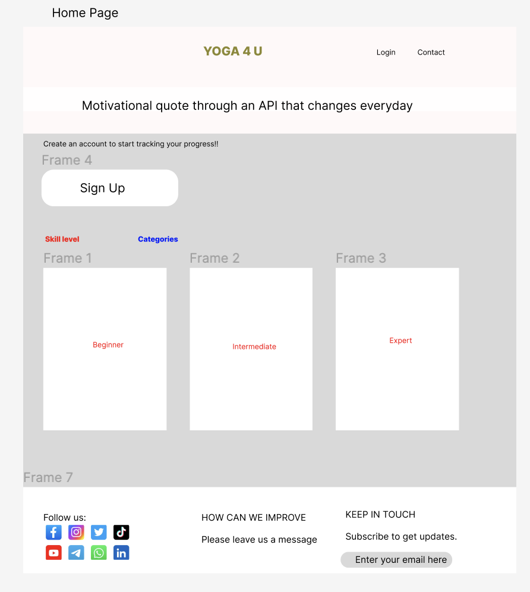
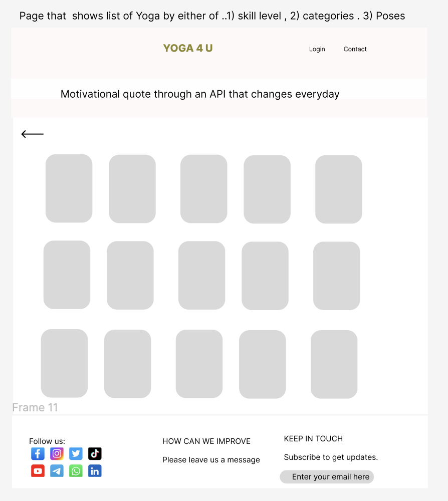
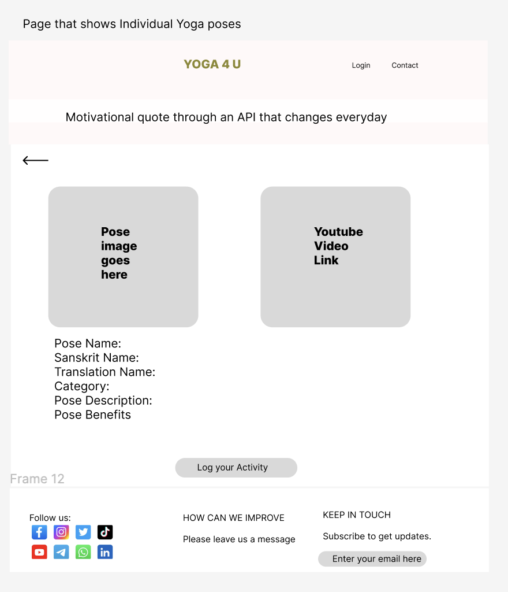
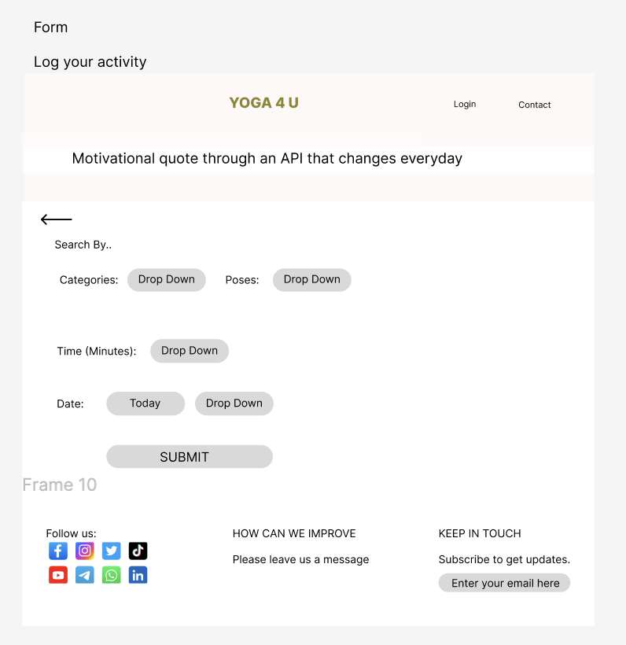
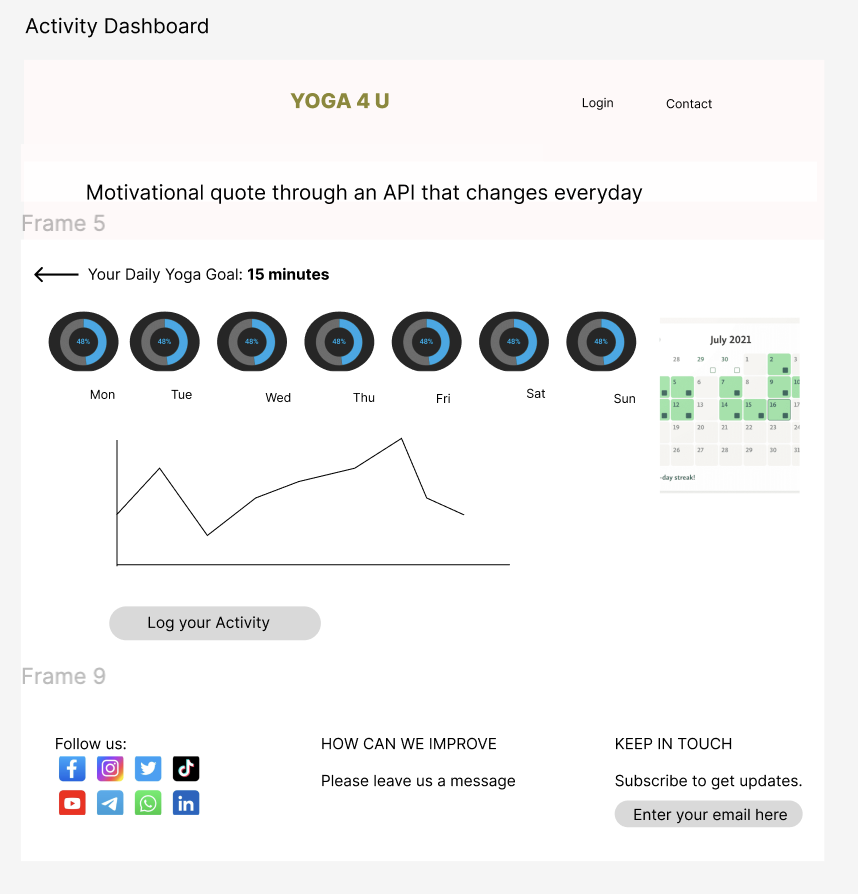
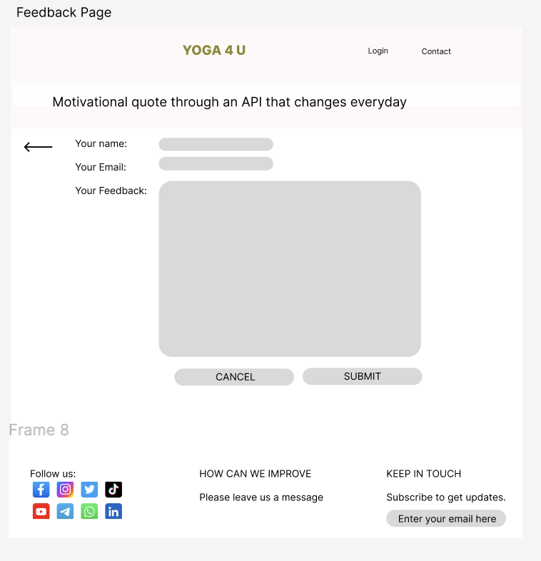

# MY YOGA FLEX

## Overview

MY YOGA FLEX is a dynamic yoga application designed to cater to yoga enthusiasts of all levels - from beginners to advanced practitioners. It offers a range of free yoga courses, allowing users to create accounts, set personal yoga goals, and track their progress. The app aims to make yoga accessible and customizable for everyone, promoting health and wellness.

### Problem

In today's fast-paced world, maintaining physical and mental well-being has become more crucial than ever. Yoga-4-U addresses the need for an accessible, user-friendly platform that supports individuals in their yoga journey, providing structured guidance and progress tracking.

### User Profile

MY YOGA FLEX is designed for individuals seeking a structured and flexible yoga practice. It caters to users of varying skill levels and offers features like goal setting and progress tracking to keep users motivated. The app is especially beneficial for those who prefer a self-paced, home-based yoga practice.

### Features

1) User Account Creation: Sign up and log in functionality with user profile management.
2) Yoga Categories and Levels: Selection of yoga categories and skill levels.
3) Yoga Pose Library: A comprehensive list of yoga poses with detailed descriptions.
4) Activity Logging: Users can log their yoga sessions, including time and date.
5) Goal Setting: Functionality to set and track yoga practice goals.
6) Progress Dashboard: Visual representation of user's yoga journey and achievements.
7) Feedback System: Users can provide feedback for continuous improvement of the app.

## Implementation

### Tech Stack

Frontend: React.js for state management, Saas for styling.
Backend: Node.js with Express.js.
Database: MySQL for storing user data and yoga pose information.
Authentication: JWT for secure user authentication.

### APIs

List any external sources of data that will be used in your app.

Request base URL: https://yoga-api-nzy4.onrender.com/v1
Request base URL for quotes: https://zenquotes.io/api/quotes

### Sitemap

1) Home Page: Category and skill level selection, user sign-up/login.
2) Yoga Poses Page: List of yoga poses.
3) Pose Details Page: Detailed information about each yoga pose.
4) Activity Log Page: Where users log their yoga sessions and set goals.
5) Progress Dashboard: Visual representation of user's progress.
6) Feedback Page: For users to provide their feedback.

### Mockups

### Data

Describe your data and the relationships between them. You can show this visually using diagrams, or write it out. 

### Endpoints

User Authentication and Account Management

1. Sign Up

Endpoint: /api/users/signup
Method: POST
Description: Registers a new user.
Body: { username, email, password }
Response: { success, message, userId }

2. Login

Endpoint: /api/users/login
Method: POST
Description: Authenticates a user.
Body: { email, password }
Response: { success, token, userId }

3. User Profile

Endpoint: /api/users/profile/:userId
Method: GET
Description: Retrieves the profile of a logged-in user.
Response: { success, user }

Yoga Poses

1. List Yoga Poses

Endpoint: /api/yoga/poses
Method: GET
Description: Retrieves a list of yoga poses.
Response: { success, poses }

2. Yoga Pose Details

Endpoint: /api/yoga/poses/:poseId
Method: GET
Description: Retrieves details of a specific yoga pose.
Response: { success, poseDetails }

User Activity and Goals

1. Log Yoga Session

Endpoint: /api/users/:userId/sessions
Method: POST
Description: Logs a yoga session for a user.
Body: { date, duration, poseId }
Response: { success, session }

2. Set Yoga Goal

Endpoint: /api/users/:userId/goals
Method: POST
Description: Sets a yoga goal for a user.
Body: { goalDuration, startDate, endDate }
Response: { success, goal }

3. User Progress

Endpoint: /api/users/:userId/progress
Method: GET
Description: Retrieves the progress of a user.
Response: { success, progress }

Feedback

1. Submit Feedback

Endpoint: /api/feedback
Method: POST
Description: Allows users to submit feedback.
Body: { userId, feedbackText }
Response: { success, message }

### Auth

Does your project include any login or user profile functionality? If so, describe how authentication/authorization will be implemented.

## Roadmap

This roadmap is for a 9-day sprint to complete the project. 

Day 1-2: Planning and Setup

Sprint Goal: Establish the foundation of the project.
Tasks:
Finalize the project requirements and features.
Set up the development environment.
Initialize the project repository and create a basic project structure.
Plan the database schema and decide on the tech stack.
Create a basic design mockup for the UI.

Day 3-4: Backend Development

Sprint Goal: Develop the core backend functionality.
Tasks:
Set up the server, database, and API routes.
Implement user authentication (signup and login).
Develop the API endpoints for yoga poses and user profiles.
Test the endpoints to ensure they work as expected.

Day 5-6: Frontend Development (Part 1)

Sprint Goal: Start building the frontend and integrate it with the backend.
Tasks:
Create the basic React components (Home, Yoga Poses List, Pose Details).
Implement routing in the React app.
Connect the frontend with the backend (fetching yoga poses, user login/signup).

Day 7: Frontend Development (Part 2)

Sprint Goal: Complete the frontend development.
Tasks:
Develop the Activity Log and Goal Setting pages.
Create the User Progress Dashboard.
Implement the Feedback submission functionality.

Day 8: Testing and Debugging

Sprint Goal: Ensure the app works smoothly and fix any bugs.
Tasks:
Conduct thorough testing of the entire application (both frontend and backend).
Debug any issues that arise.
Validate the user experience and ensure all features are working as intended.

Day 9: Final Touches and Deployment

Sprint Goal: Polish the application and prepare for deployment.
Tasks:
Refine the UI/UX, adjust styling and layouts.
Optimize performance and conduct final testing.
Prepare and write the final documentation (README.md, code comments).
Deploy the application to a hosting service.

## Nice-to-haves

1) Live Yoga Classes: Integration of live yoga sessions.
2) Community Forum: A platform for users to share experiences and tips.
3) Personalized Recommendations: AI-based suggestions for yoga poses and routines.
4) ChatBot Integration: Able to answer questions regarding yoga and get tailored answer
